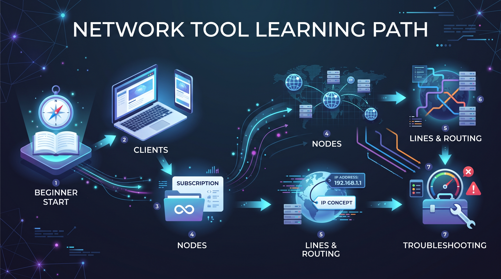

---
layout: default
title: 2026机场推荐 & Clash / VPN 资源导航
description: 系统化整理机场推荐、机场评测、Clash、VPN、代理客户端、网络加速以及相关使用教程资源。
---
# 🌐 2026机场推荐 & Clash / VPN 资源导航

这个 Repository 用于系统化整理机场推荐、机场评测、Clash、VPN、代理客户端、网络加速以及相关使用教程。通过统一的内容索引，帮助用户快速找到不同主题的实用文章。

---

# 📚 内容导航

## ✈️ 机场推荐
- [2026 机场推荐](https://clashwiki.blog/topics/airport-recommendation/)
- [2026 机场套餐选购与价格对比](https://jichangbay.com/)
- [如何挑选机场节点](https://jichangmao.com/blog/how-to-choose-an-airport-guide/)
- [为什么说低价服务商越省越血亏？](https://vpn-clash.net/cost-guide)

## 🔍 机场评测
- [全网服务商信息档案库（20家品牌对比）](https://vpn-clash.net/brands)
- [服务商深度评测](https://clashwiki.blog/brands/)
- [机场测评汇总](https://jichangmao.com/evaluations/)
- [Sogo 评测](https://bestjichang.com/blog/review-03-sogo/)
- [幕光 评测](https://bestjichang.com/blog/review-04-muguang/)

## 🧩 Clash 教程
- **[Clash 新手配置与节点选择完整教程](https://colasaiko.github.io/Clash-/)**
  *(从 Clash 基础配置、订阅导入，到节点延迟、丢包、速度、稳定性测试以及 URL-Test、Fallback 等自动选择方式。)*
- [Clash 基础配置](https://colasaiko.github.io/Clash-/01-Clash%E5%9F%BA%E7%A1%80%E9%85%8D%E7%BD%AE.html)
- [节点质量判断](https://colasaiko.github.io/Clash-/02-%E8%8A%82%E7%82%B9%E8%B4%A8%E9%87%8F%E5%88%A4%E6%96%AD.html)
- [实际测试节点](https://colasaiko.github.io/Clash-/03-%E5%AE%9E%E9%99%85%E6%B5%8B%E8%AF%95%E8%8A%82%E7%82%B9.html)
- [新手常见误区](https://colasaiko.github.io/Clash-/04-%E6%96%B0%E6%89%8B%E5%B8%B8%E8%A7%81%E8%AF%AF%E5%8C%BA.html)
- [推荐工具](https://colasaiko.github.io/Clash-/05-%E6%8E%A8%E8%8D%90%E5%B7%A5%E5%85%B7.html)
- [Clash 系列教程](https://clashwiki.blog/tag/clash/)
- [Loon客户端基础进阶教程 | Clash配置](https://jichangmao.com/blog/ios-loon-guide/)
- [Quantumult进阶教程 | Clash配置](https://jichangmao.com/blog/ios-quantumultx-guide/)
- [Surgefor进阶教程 | Clash配置](https://jichangmao.com/blog/ios-surge-guide/)

## 💻 客户端教程

### Windows
- [Windows 客户端推荐 / v2rayN](https://jichangmao.com/blog/windows-v2rayn-guide/)

### macOS
- [macOS 客户端推荐 / Clash Verge Rev](https://jichangmao.com/blog/mac-clash-verge-rev-guide/)
- [Mac 网络客户端怎么选？Clash Verge Rev、sing-box 和 Stash 对比](https://bestjichang.com/blog/mac-client-comparison/)

### iOS
- [iOS 客户端推荐 / Shadowrocket](https://jichangmao.com/blog/shadowrocket-guide/)

### Android
- [Android 客户端推荐 / v2rayNG](https://jichangmao.com/blog/v2rayng-guide/)

## 🤖 AI 服务
- [AI 工具导航](https://clashwiki.blog/category/ai-tools/)
- [ChatGPT 专区](https://clashwiki.blog/tag/chatgpt/)
- [Claude 专区](https://clashwiki.blog/tag/claude/)
- [ChatGPT 等 AI 工具无缝访问](https://vpn-clash.net/topics/ai)

## 🎬 流媒体
- [影音娱乐与流媒体解锁](https://vpn-clash.net/topics/streaming)

## 🛡️ 新手指南

- **[VPN / Clash 新手完整入门教程](https://colasaiko.github.io/NewbieRead/)**
- [网络代理工具、节点与线路基础](https://colasaiko.github.io/NewbieRead/01-%E6%96%B0%E6%89%8B%E5%BC%80%E5%A4%B4.html)
- [线路介绍：直连、中转与专线](https://colasaiko.github.io/NewbieRead/03-%E8%B7%AF%E7%BA%BF%E4%BB%8B%E7%BB%8D.html)
- [IP 基础介绍：原生与住宅 IP](https://colasaiko.github.io/NewbieRead/04-IP%E4%BB%8B%E7%BB%8D.html)
- [新手选择总结](https://colasaiko.github.io/NewbieRead/05-%E6%96%B0%E6%89%8B%E6%80%BB%E7%BB%93.html)
- [新手常见 FAQ 大总结](https://colasaiko.github.io/NewbieRead/06-FAQ%E5%92%8C%E5%A4%A7%E6%80%BB%E7%BB%93.html)
- [翻墙新手入门](https://clashwiki.blog/guides/)
- [什么是机场？](https://jichangmao.com/blog/what-is-airport-proxy/)
- [什么是节点？](https://jichangmao.com/blog/what-is-node/)
- [什么是订阅链接？](https://jichangmao.com/blog/what-is-subscription/)
- [什么是虚拟网卡 TUN？](https://jichangmao.com/blog/what-is-tun-mode/)
- [首次配置防坑指南](https://jichangmao.com/blog/first-time-proxy-guide/)
- [网络排障与测速](https://clashwiki.blog/category/troubleshooting/)
- [订阅故障与网络急救手册](https://vpn-clash.net/topics/troubleshooting)

---

# 🌐 博客网络

本指南的内容索引主要来源于以下持续维护的优质站点：

| 网站 | 主要内容 |
|---|---|
| [Clash Wiki](https://clashwiki.blog) | Clash / VPN 基础教程、AI 工具专区（ChatGPT/Claude）及代理工具排障 |
| [机场 Blog](https://jichangblog.net) | 持续更新的机场评测（WgetCloud、TAG、飞鸟、一元机场等）与优惠资讯 |
| [VPN Clash](https://vpn-clash.net) | 深度网络加速场景分析（流媒体、外贸、AI）及 20 家服务商避坑横评 |
| [机场猫](https://jichangmao.com) | 机场性价比对比、全平台客户端图文配置教程及网络原理科普 |
| [Best 机场](https://bestjichang.com) | 主流代理客户端横向评测、精品机场（Sogo、幕光等）测评与体验 |
| [机场湾 JichangBay](https://jichangbay.com/) | 2026机场推荐、套餐价格、流量、线路、优惠与品牌选购导航 |
| [NewbieRead 新手教程](https://colasaiko.github.io/NewbieRead/) | VPN、Clash、节点、线路、IP 与客户端基础入门教程 |
| [Clash Guide](https://colasaiko.github.io/Clash-/) | Clash 配置、节点测试、网络质量判断与进阶使用教程。 |
| [Runa iNav](https://runainav.com) | 🚧 即将上线 |

---

# 📌 关于本项目

本 Repository 作为多站点内容的统一入口，致力于系统化整合机场、Clash、VPN、代理客户端、网络加速等相关领域的学习资料。
本项目由 [Colasaiko](https://github.com/Colasaiko) 持续维护。
随着各博客的文章更新，本项目也会持续收录更多实用教程，方便用户精准检索所需信息。

---

# 📬 联系与纠错

如果发现链接失效、资料需要更新或内容存在错误，可以通过以下方式反馈：

- 🌐 机场湾：https://jichangbay.com/
- 📧 Email：colasaiko15@gmail.com
- 💬 Telegram：@ColaSaiko15
- 🧑‍💻 GitHub：https://github.com/Colasaiko

如果问题与本 Repository 本身有关，也可以通过 GitHub Issues 提交反馈。

